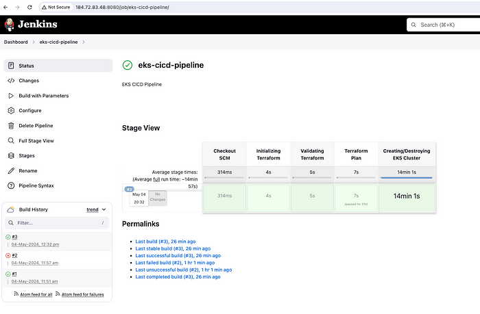
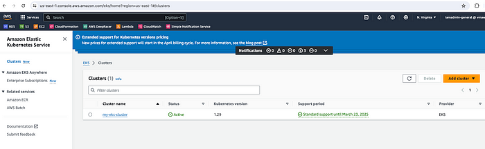

# **Automated EKS Deployment with CI/CD: A Complete Guide Using Jenkins and Terraform**


## **Overview**

This repository provides a step-by-step guide to automating the deployment of an Amazon Elastic Kubernetes Service (EKS) cluster and a Kubernetes-based application using Jenkins and Terraform. By integrating infrastructure-as-code (IaC) and continuous integration/continuous deployment (CI/CD), this project simplifies and accelerates the delivery pipeline.

---

## **Features**

- 🚀 **Automated EKS Deployment**: Use Terraform to provision a scalable, secure, and resilient EKS cluster.
- 🕠 **CI/CD Pipeline with Jenkins**: Configure a Jenkins pipeline to automate cluster setup and application deployment.
- 🌐 **Kubernetes Integration**: Deploy and manage containerized applications with Kubernetes manifest files.
- 🔒 **Infrastructure as Code**: Ensure reproducibility and reliability with Terraform scripts.
- 📈 **Scalable Architecture**: Leverage AWS cloud infrastructure for high availability.

---

## **Project Structure**

```plaintext
📂 Root Directory
├── 📂 tf-aws-eks          # Terraform scripts for EKS cluster creation
├── 📂 jenkins_server      # Terraform and shell scripts for Jenkins setup
├── 📂 manifest            # Kubernetes YAML files for application deployment
├── install_tools.sh       # Script for installing tools on Jenkins server
├── Jenkinsfile            # Jenkins pipeline script
├── README.md              # Documentation
├── image.png              # Project diagram or preview
├── architecture.png       # Architecture diagram
```

---

## **Architecture Diagram**


---

## **Key Components**

### **1. Setting Up Jenkins**

- Create an EC2 instance with Terraform to host Jenkins.
- Install tools like `Java`, `Terraform`, `Docker`, `AWS CLI`, and `Kubectl`.
- Configure Jenkins for CI/CD operations.

**Shell Script for Installing Tools:**

Save the following content into a file named `install_tools.sh` and use it for automating tool installation on the Jenkins server:

```bash
#!/bin/bash

# Update system
sudo yum update -y

# Install Java
sudo yum install -y java-11-amazon-corretto

# Install Jenkins
sudo yum install wget -y
sudo wget -O /etc/yum.repos.d/jenkins.repo https://pkg.jenkins.io/redhat/jenkins.repo
sudo rpm --import https://pkg.jenkins.io/redhat/jenkins.io.key
sudo yum install jenkins -y
sudo systemctl enable jenkins
sudo systemctl start jenkins

# Install Docker
sudo yum install -y docker
sudo systemctl enable docker
sudo systemctl start docker
sudo usermod -aG docker ec2-user
sudo usermod -aG docker jenkins

# Install AWS CLI
curl "https://awscli.amazonaws.com/awscli-exe-linux-x86_64.zip" -o "awscliv2.zip"
unzip awscliv2.zip
sudo ./aws/install

# Install Terraform
sudo yum install -y yum-utils
sudo yum-config-manager --add-repo https://rpm.releases.hashicorp.com/AmazonLinux/hashicorp.repo
sudo yum install -y terraform

# Install Kubectl
curl -LO "https://storage.googleapis.com/kubernetes-release/release/$(curl -s https://storage.googleapis.com/kubernetes-release/release/stable.txt)/bin/linux/amd64/kubectl"
sudo chmod +x ./kubectl
sudo mv ./kubectl /usr/local/bin/kubectl

# Verify installations
java -version
jenkins --version
docker --version
aws --version
terraform --version
kubectl version --client
```

Make sure to run this script as part of the EC2 instance provisioning process using `user_data` in Terraform.

**Example Terraform Configuration:**

```hcl
resource "aws_instance" "jenkins" {
  ami           = "ami-0e8a34246278c21e4"
  instance_type = "t2.medium"
  key_name      = "jenkins_keypair"

  user_data = file("install_tools.sh")

  tags = {
    Name = "Jenkins-Server"
  }
}
```

---

### **2. EKS Cluster Creation**

- Write Terraform scripts to create a secure and scalable EKS cluster within a private subnet.
- Secure cluster access using IAM roles and policies.

**Terraform Configuration for EKS Cluster:**

```hcl
# backend.tf
terraform {
  backend "s3" {
    bucket = "terraform-eks-cicd-unique"
    key    = "eks/terraform.tfstate"
    region = "us-east-1"
  }
}
```

```hcl
# eks.tf
module "eks" {
  source  = "terraform-aws-modules/eks/aws"
  cluster_name    = "my-eks-cluster"
  cluster_version = "1.21"

  vpc_id     = module.vpc.vpc_id
  subnet_ids = module.vpc.private_subnets

  eks_managed_node_groups = {
    default = {
      min_size     = 2
      max_size     = 5
      desired_size = 3
      instance_types = ["t3.medium"]
    }
  }
}
```

---

### **3. Application Deployment**

- Deploy a simple Nginx application to the EKS cluster using Kubernetes manifests.
- Configure a LoadBalancer to expose the application.

**Kubernetes Manifests for Application Deployment:**

```yaml
# deployment.yaml
apiVersion: apps/v1
kind: Deployment
metadata:
  name: nginx
spec:
  replicas: 2
  selector:
    matchLabels:
      app: nginx
  template:
    metadata:
      labels:
        app: nginx
    spec:
      containers:
      - name: nginx
        image: nginx:latest
        ports:
        - containerPort: 80
```

```yaml
# service.yaml
apiVersion: v1
kind: Service
metadata:
  name: nginx-service
spec:
  selector:
    app: nginx
  ports:
  - protocol: TCP
    port: 80
    targetPort: 80
  type: LoadBalancer
```

---

### **4. CI/CD Pipeline**

- Automate EKS provisioning and application deployment using a Jenkins pipeline.
- Integrate Terraform and Kubernetes commands into Jenkins stages.

**Jenkinsfile for CI/CD Pipeline:**

```groovy
pipeline {
  agent any
  environment {
    AWS_ACCESS_KEY_ID = credentials('AWS_ACCESS_KEY_ID')
    AWS_SECRET_ACCESS_KEY = credentials('AWS_SECRET_ACCESS_KEY')
  }
  stages {
    stage('Terraform Init') {
      steps {
        sh 'terraform init'
      }
    }
    stage('Terraform Plan') {
      steps {
        sh 'terraform plan -var-file=variables/dev.tfvars'
      }
    }
    stage('Terraform Apply') {
      steps {
        sh 'terraform apply -var-file=variables/dev.tfvars -auto-approve'
      }
    }
    stage('Deploy Application') {
      steps {
        sh 'kubectl apply -f manifest/deployment.yaml'
        sh 'kubectl apply -f manifest/service.yaml'
      }
    }
  }
}
```

---

## **Pre-Requisites**

Before you begin, ensure the following are ready:

1. **AWS Account**: Set up an IAM user with access keys for Terraform and Jenkins.
2. **Tools Installed**:
   - AWS CLI ([Install Guide](https://docs.aws.amazon.com/cli/latest/userguide/install-cliv2.html))
   - Terraform ([Install Guide](https://developer.hashicorp.com/terraform/tutorials/aws-get-started/install-cli))
   - Kubectl ([Install Guide](https://kubernetes.io/docs/tasks/tools/install-kubectl/))
3. **Key Pair**: Create an EC2 key pair for SSH access to the Jenkins server.

---

## **How to Use**

1. **Clone the Repository**:

   ```bash
   git clone <repository_url>
   cd <repository_folder>
   ```

2. **Initialize Terraform**:

   ```bash
   cd jenkins_server
   terraform init
   ```

3. **Apply Terraform Configuration**:

   ```bash
   terraform apply -var-file=variables/dev.tfvars
   ```

4. **Access Jenkins**:

   - Retrieve the Jenkins server's public IP and open it in a browser.
   - Follow the setup instructions and configure the pipeline.

5. **Run the Jenkins Pipeline**:

   - Configure your AWS credentials and Git repository in Jenkins.
   - Start the pipeline to deploy the EKS cluster and application.

---

## **Outputs**

- A running EKS cluster on AWS.
- A deployed Nginx application accessible via a LoadBalancer endpoint.
- A Jenkins pipeline automating infrastructure and application deployment.

---

## **Screenshots**

### Jenkins Pipeline Execution



### EKS Cluster in AWS



### Application Running


---

## **Future Enhancements**

- **Monitoring & Logging**: Integrate Prometheus and Grafana for monitoring.
- **Security Improvements**: Add secret management and fine-grained access control.
- **Multi-Environment Deployment**: Support staging and production environments.

---

## **Contributing**

Contributions are welcome! Feel free to submit a pull request or open an issue for discussion.

---

## **License**

This project is licensed under the [MIT License](LICENSE).

---

